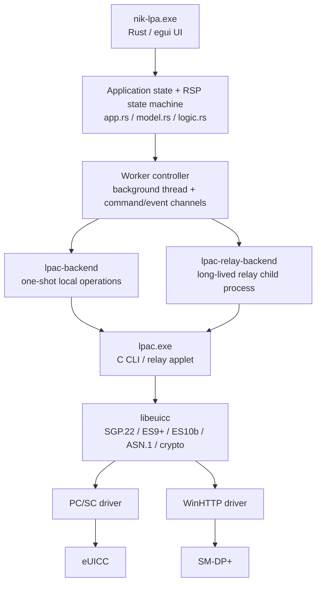
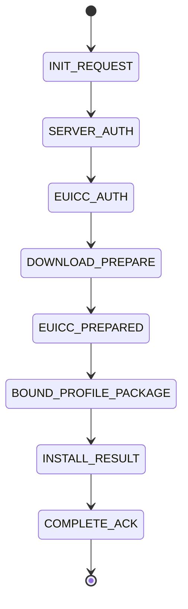

# NIK LPA architecture

## Purpose

NIK LPA is a Windows desktop application for local eUICC provisioning and for a staged RSP relay where the computer connected to the eUICC can remain without an Internet HTTP backend.

The architecture deliberately keeps the existing `lpac` / `libeuicc` C implementation as the protocol engine and places the Windows UI, process supervision, state validation, and operator workflow in Rust.

## Layered architecture



## Responsibilities

### `lpac` / `libeuicc` C layer

The C layer remains the source of truth for protocol operations. It owns:

- PC/SC and APDU transport;
- HTTP transport;
- SGP.22 state and protocol encoding;
- ES9+ server calls;
- ES10b eUICC calls;
- certificate processing;
- ASN.1 processing;
- Bound Profile Package loading.

The staged relay applet is implemented in `src/applet/relay.c`. It exposes long-lived JSON request/response operations over stdin/stdout while keeping the underlying eUICC or SM-DP+ session alive.

### `lpac-backend`

`lpac-backend` is the one-shot adapter used by Local LPA operations and read-only utility operations such as reader discovery, eUICC information, Profile List, and standard profile download.

The GUI does not open a second PC/SC connection. The C runtime remains the only process that owns the reader.

### `lpac-relay-backend`

`lpac-relay-backend` supervises one long-lived `lpac relay ...` child process.

It enforces role-specific transport isolation:

| Role | APDU backend | HTTP backend |
|---|---|---|
| Card Agent | `pcsc` | `stdio` |
| Server Agent | `stdio` | `winhttp` |

Therefore Card Agent does not load the WinHTTP relay backend, and Server Agent does not load the PC/SC relay backend.

The backend also:

- correlates requests with UUID request IDs;
- validates operation names in responses;
- captures bounded stderr history;
- performs graceful shutdown;
- hides helper console windows on Windows.

### GUI application

The primary application is `nik-lpa.exe`.

Its internal modules are separated by responsibility:

- `app.rs` — application-owned state and lifecycle;
- `controller.rs` — background worker and command/event boundary;
- `logic.rs` — domain orchestration and transition handling;
- `model.rs` — relay-session model and plaintext debug packet codec;
- `views.rs` — page composition and responsive layout;
- `theme.rs` — NIK design tokens, typography, colors, spacing;
- `widgets.rs` — reusable cards, buttons, badges, navigation, timeline primitives.

The UI thread never performs blocking `lpac` work directly. All process operations go through the worker controller.

## Relay state model

The relay uses a strict eight-stage state machine:



Each packet includes:

- protocol version;
- job UUID;
- strict sequence number;
- stage and direction;
- target EID hash;
- SM-DP+ transaction ID after `SERVER_AUTH`;
- creation and expiry timestamps;
- previous-message hash;
- stage-specific JSON payload.

`RelayPacket::validate_after()` rejects stage reordering, sequence gaps, EID changes, transaction changes, expired packets, timestamp rollback, and broken previous-message hashes.

## Current transport

The current engineering build uses readable packets:

```text
NIKRSP-DEBUG1:{...json...}
```

This is intentional so protocol data can be inspected during hardware debugging. It is not the final secure transport.

The old encrypted transport code remains isolated from the active UI flow and can be reused after the staged protocol has been fully validated.

## Installation verification

`LoadBoundProfilePackage` success is not considered sufficient by itself.

After BPP loading, Card Agent:

1. stops the long-lived card relay helper;
2. starts a fresh `profile list` operation;
3. verifies that the expected ICCID is present;
4. creates `INSTALL_RESULT` only after that independent verification;
5. waits for `COMPLETE_ACK` from Server Agent before the relay job is considered complete on both sides.

This avoids reporting success when the final profile state was not independently confirmed.

## UI architecture review

### Strengths

- protocol ownership is isolated in C instead of duplicated in Rust;
- Card and Server transports are explicitly separated;
- blocking process I/O is kept off the egui thread;
- relay state validation is centralized instead of spread through UI handlers;
- reusable UI primitives keep colors, spacing, radii, and control height consistent;
- the current responsive shell supports full-width desktop use and two application windows side by side.

### Current technical debt

The following items are known but do not block the current hardware-validation workflow:

1. `views.rs` is still the largest presentation module and should eventually be split by page when another major screen is added.
2. Relay sessions are not persisted across application restarts.
3. `NIKRSP-DEBUG1` is plaintext by design and must not be treated as a production security boundary.
4. Large BPP transfer is currently optimized for manual copy/paste rather than a durable file transport.
5. Windows installer/code signing and release-grade crash recovery are still outside the current engineering milestone.

The current structure is intentionally kept simple until the staged relay is fully validated on target hardware; further abstraction should follow real reuse rather than speculative framework work.

## Design system

The production shell uses:

- **Roboto** bundled into the executable;
- 14 px primary UI text;
- 44 px interactive controls;
- 24 px standard card padding;
- 16 px compact card padding;
- 24 px desktop page gutter;
- 830 px maximum content rail;
- responsive 260 px / 60 px sidebar;
- NIK red for brand/navigation emphasis;
- blue for primary actions;
- dedicated success and warning states;
- coordinated light and dark palettes.

All new screens should reuse `theme.rs` and `widgets.rs` instead of introducing local colors or control geometry.
