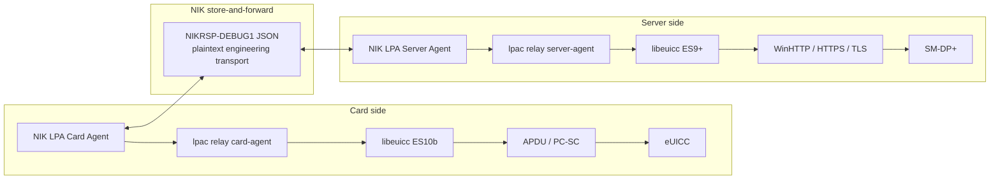
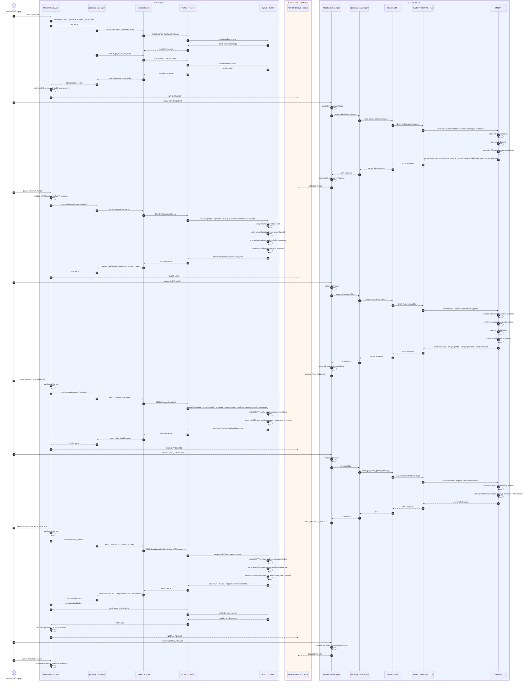

# NIK LPA staged RSP relay

## Purpose

This document describes the current NIK LPA staged SGP.22 flow at implementation level.

It answers, for every stage:

- which function is called;
- which component calls it;
- which input fields it needs;
- where each field came from;
- which protocol transports the data;
- which certificate/signature role is involved;
- what the eUICC or SM-DP+ validates;
- what output is returned;
- how NIK wraps and validates that output;
- where the output is consumed next.

The current product splits one RSP transaction into two execution roles:

```text
Card Agent  = ES10b / eUICC side
Server Agent = ES9+ / SM-DP+ side
```

The transport between the two NIK applications is currently a readable engineering envelope:

```text
NIKRSP-DEBUG1:<JSON>
```

It is intentionally plaintext. It must not be confused with the cryptographic protections inside SGP.22 itself.

## Protocol layers



There are therefore four distinct interfaces to keep separate:

| Interface | Where | Data format/role |
|---|---|---|
| Rust GUI ↔ `lpac relay` | same Windows machine | NDJSON over stdin/stdout |
| Card Agent ↔ Server Agent | separate NIK instances | `NIKRSP-DEBUG1:<JSON>` |
| Server Agent ↔ SM-DP+ | network | ES9+ over HTTPS/TLS |
| Card Agent ↔ eUICC | local smart-card path | ES10b encoded into ASN.1/BER-TLV/APDU via PC/SC |

## Certificate roles used by the flow

The relay C adapter deliberately uses generic library field names and does not parse certificate internals in Rust.

The important protocol roles are:

| NIK/libeuicc field | Protocol role | Source | Consumer |
|---|---|---|---|
| `euiccCiPKIdToBeUsed` | identifies the Certificate Issuer public-key context selected for eUICC verification | SM-DP+ InitiateAuthentication response | eUICC AuthenticateServer |
| `serverCertificate` | SM-DP+ authentication-signing certificate role, commonly `CERT.DPauth.SIG` in SGP.22 terminology | SM-DP+ | eUICC AuthenticateServer |
| `serverSignature1` | signature over `serverSigned1` | SM-DP+ private signing key | eUICC verifies it using trusted certificate chain |
| eUICC/EUM certificate/signature material | card-side authentication evidence carried inside the encoded response | eUICC / EUM trust domain | SM-DP+ AuthenticateClient |
| `smdpCertificate` | SM-DP+ profile-binding signing certificate role, commonly `CERT.DPpb.SIG` | SM-DP+ AuthenticateClient response | eUICC PrepareDownload |
| `smdpSignature2` | signature over `smdpSigned2` | SM-DP+ private signing key | eUICC PrepareDownload validates it |

Important: NIK Rust currently treats `authenticateServerResponse` and `prepareDownloadResponse` as opaque encoded protocol objects. It does not extract or replace the inner eUICC/EUM certificate structures.

## Detailed sequence diagram



## Stage 0: Card access and EID

Before the eight relay packets, Card Agent performs a normal local chip-information operation and obtains the EID.

NIK does not put the raw EID in the relay envelope. It creates:

```text
target_eid_hash = SHA-256(EID)
```

This hash is an application-level identity binding used to prevent packets for different eUICCs from being mixed into the same relay chain.

The desktop path is:

```text
nik-lpa.exe
  -> lpac-backend one-shot chip-info
  -> lpac/libeuicc
  -> PC/SC
  -> eUICC
```

On future STM32 hardware this PC/SC layer will be replaced by a direct or modem-backed APDU HAL; the ES10b semantics remain the same.

## Stage 1 — `INIT_REQUEST`

### Function calls

```text
card.init
  -> es10b_get_euicc_challenge_r(&euicc_ctx, &euicc_challenge)
  -> es10b_get_euicc_info_r(&euicc_ctx, &euicc_info_1)
```

### Input

No remote protocol payload. Only an initialized card/eUICC context is needed.

### Card communication

```text
libeuicc ES10b
 -> ASN.1/BER-TLV command encoding
 -> APDU
 -> PC/SC reader
 -> eUICC / ISD-R
```

### Output

```json
{
  "euiccChallenge": "<encoded eUICC challenge>",
  "euiccInfo1": "<encoded EUICCInfo1>"
}
```

`euiccChallenge` is fresh card-generated data used to make server authentication specific to this active attempt.

`euiccInfo1` describes RSP/eUICC capability information required by the server authentication flow. It is not the EID.

### NIK envelope

```text
stage = INIT_REQUEST
sequence = 1
transaction_id = null
previous_message_hash = null
```

## Stage 2 — `SERVER_AUTH`

### Input source

Server Agent reads the activation code and obtains:

```text
serverAddress = SM-DP+ address
matchingId = profile/order matching value
```

From `INIT_REQUEST` it obtains:

```text
euiccChallenge
euiccInfo1
```

### Server function

```text
server.initiateAuthentication
  -> es9p_initiate_authentication_r(
         &euicc_ctx,
         &transaction_id,
         &response,
         server_address,
         euicc_challenge,
         euicc_info_1)
```

### Network protocol

```text
ES9+.InitiateAuthentication
  over HTTPS/TLS
  using WinHTTP backend
```

### SM-DP+ output

```text
transactionId
serverSigned1
serverSignature1
euiccCiPKIdToBeUsed
serverCertificate
```

The C adapter exposes them as strings in JSON.

### Certificate/signature meaning

`serverCertificate` is the encoded SM-DP+ authentication-signing certificate role used by the eUICC to authenticate the SM-DP+. In SGP.22 terminology this role is commonly referred to as `CERT.DPauth.SIG`.

`euiccCiPKIdToBeUsed` tells the eUICC which Certificate Issuer public-key context is to be used for the verification chain.

`serverSignature1` authenticates the relevant `serverSigned1` structure. Signed data is not the same as encrypted data.

### Data added by NIK before Card Agent

NIK adds the application inputs needed by the card-side operation:

```text
matchingId
serverAddress
```

The current card C handler consumes `matchingId`; `serverAddress` remains useful application/session context in the envelope.

### NIK output packet

Main payload:

```json
{
  "transactionId": "...",
  "serverSigned1": "...",
  "serverSignature1": "...",
  "euiccCiPKIdToBeUsed": "...",
  "serverCertificate": "...",
  "matchingId": "...",
  "serverAddress": "..."
}
```

`SERVER_AUTH` introduces the SM-DP+ `transactionId`. NIK requires all subsequent relay packets to preserve it.

## Stage 3 — `EUICC_AUTH`

### Card function

```text
card.authenticateServer
  -> es10b_authenticate_server_r(...)
```

### Required input

```text
serverSigned1
serverSignature1
euiccCiPKIdToBeUsed
serverCertificate
matchingId
optional IMEI
```

### What reaches the card

`libeuicc` converts the input structures into the appropriate ES10b/ASN.1 form and sends the AuthenticateServer operation through APDU/PCSC to the eUICC.

### What the eUICC validates

Conceptually the eUICC performs the protocol-owned checks, including:

```text
trusted Certificate Issuer / certificate-chain context
server authentication certificate role
serverSignature1 authenticity/integrity
serverSigned1/session/challenge binding
other SGP.22 AuthenticateServer semantic checks
```

NIK Rust does not attempt to reproduce these cryptographic checks.

### Card output

```json
{
  "authenticateServerResponse": "<opaque encoded response>",
  "transactionIdLength": 16
}
```

The exact transaction-ID length is card/protocol output and is not assumed to be the example value above.

The C relay keeps the returned transaction-ID bytes in `relay_card_state` so the card-side session can later be cancelled correctly.

### Opaque eUICC authentication response

The encoded `authenticateServerResponse` may contain the eUICC-side signed/certificate evidence required by SGP.22 (eUICC/EUM trust material). The current NIK relay intentionally does not split these structures into separate Rust fields. It forwards the response unchanged to the Server Agent.

## Stage 4 — `DOWNLOAD_PREPARE`

### Server input

```text
serverAddress
transactionId
authenticateServerResponse
```

### Function

```text
server.authenticateClient
  -> es9p_authenticate_client_r(...)
```

### Network operation

```text
ES9+.AuthenticateClient
  over HTTPS/TLS
```

### What SM-DP+ checks

SM-DP+ receives the card-generated authentication response for the same `transactionId` and performs the server-side validation of the eUICC authentication evidence.

### Output from SM-DP+

```text
profileMetadata
smdpSigned2
smdpSignature2
smdpCertificate
```

### Certificate/signature role

`smdpCertificate` is the encoded SM-DP+ profile-binding signing certificate role used by PrepareDownload; in SGP.22 terminology this is commonly referred to as `CERT.DPpb.SIG`.

`smdpSignature2` authenticates `smdpSigned2`.

### Optional confirmation code

If the profile requires a Confirmation Code, NIK adds:

```text
confirmationCode
```

before creating the outgoing packet.

### Outgoing payload

```json
{
  "profileMetadata": "...",
  "smdpSigned2": "...",
  "smdpSignature2": "...",
  "smdpCertificate": "...",
  "confirmationCode": "<optional>"
}
```

Because `NIKRSP-DEBUG1` is plaintext, a present Confirmation Code is currently visible to anyone who sees that packet. This is acceptable only for the controlled engineering phase.

## Stage 5 — `EUICC_PREPARED`

### Card function

```text
card.prepareDownload
  -> es10b_prepare_download_r(...)
```

### Input

```text
profileMetadata
smdpSigned2
smdpSignature2
smdpCertificate
optional confirmationCode
```

### Card-side protocol work

The eUICC receives the corresponding ES10b PrepareDownload data through the APDU path and validates the profile-binding/signature/certificate material according to SGP.22.

It then creates card-side preparation material that SM-DP+ needs before the BPP can be obtained for this target session.

### Output

```json
{
  "prepareDownloadResponse": "<opaque encoded response>"
}
```

NIK does not parse the one-time/key-related internals out of this response. The object is intentionally opaque between `libeuicc` and the next ES9+ operation.

## Stage 6 — `BOUND_PROFILE_PACKAGE`

### Server function

```text
server.getBpp
  -> es9p_get_bound_profile_package_r(
         &euicc_ctx,
         &bound_profile_package,
         server_address,
         transaction_id,
         prepare_download_response)
```

### Input

```text
serverAddress
transactionId
prepareDownloadResponse
```

### Network operation

```text
ES9+.GetBoundProfilePackage
  over HTTPS/TLS
```

### SM-DP+ work

SM-DP+ uses the active transaction and the eUICC-generated preparation/binding material to return the Bound Profile Package for the target eUICC/session.

NIK LPA does not create this package and does not receive profile secrets such as Ki as separate plaintext variables.

### Output

```json
{
  "boundProfilePackage": "<encoded protected BPP>"
}
```

### Two protection layers must not be confused

```text
Outer NIK transport:
NIKRSP-DEBUG1 JSON = plaintext

Inner BPP:
SGP.22 protected/bound profile package = protocol-protected profile data
```

Seeing the encoded BPP string in the debug packet is not the same as NIK receiving the subscriber secrets as decoded plaintext fields.

## Stage 7 — `INSTALL_RESULT`

### Card function

```text
card.installBpp
  -> es10b_load_bound_profile_package_r(...)
```

### Input

```text
boundProfilePackage
```

### Direct eUICC communication

The BPP is decoded/processed by the existing C/libeuicc protocol engine and sent through the ES10b LoadBoundProfilePackage command sequence:

```text
BPP
 -> libeuicc BPP/ASN.1 logic
 -> ES10b structures
 -> one or more APDU command/response exchanges
 -> PC/SC reader
 -> eUICC
```

The eUICC performs the protected profile installation internally. NIK does not implement a sequence such as “write IMSI” or “write Ki” directly.

### eUICC result fields returned by current relay handler

```text
sequenceNumber
iccid
bppCommandId
bppCommand
errorReason
errorReasonName
```

`sequenceNumber` here is a BPP/eUICC result value and is unrelated to NIK packet sequence 1..8.

### Independent verification

A successful LoadBPP result is not enough for NIK.

Card Agent then:

```text
1. saves expected ICCID from LoadBPP result
2. stops the long-lived relay helper to release PC/SC ownership
3. runs a fresh one-shot Profile List
4. searches the returned profiles for the exact expected ICCID
5. creates INSTALL_RESULT only if the ICCID is present
```

Outgoing application payload:

```json
{
  "status": "installed",
  "iccid": "<verified ICCID>",
  "sequenceNumber": "<LoadBPP sequence>",
  "notification": "pending"
}
```

## Stage 8 — `COMPLETE_ACK`

This is a NIK application-level synchronization packet, not an ES9+ or ES10b card command.

After Server Agent accepts a valid `INSTALL_RESULT`, it creates:

```json
{
  "status": "acknowledged",
  "iccid": "...",
  "receivedAt": "..."
}
```

Card Agent only marks its staged job complete after this final packet passes relay validation.

## Function/data/source matrix

| Stage | Function | Inputs | Where inputs come from | Output | Next consumer |
|---|---|---|---|---|---|
| Init | `es10b_get_euicc_challenge_r` | eUICC context | local card session | `euiccChallenge` | SM-DP+ InitiateAuthentication |
| Init | `es10b_get_euicc_info_r` | eUICC context | local card session | `euiccInfo1` | SM-DP+ InitiateAuthentication |
| Server auth | `es9p_initiate_authentication_r` | serverAddress, challenge, EUICCInfo1 | activation code + card | transactionId, serverSigned1, signature, CI key ID, auth cert | eUICC AuthenticateServer |
| Card auth | `es10b_authenticate_server_r` | serverSigned1, signature, CI key ID, auth cert, Matching ID, optional IMEI | SM-DP+ + activation context | `authenticateServerResponse` | SM-DP+ AuthenticateClient |
| Client auth | `es9p_authenticate_client_r` | serverAddress, transactionId, authenticateServerResponse | activation code + eUICC response | metadata, smdpSigned2, signature2, profile-binding cert | eUICC PrepareDownload |
| Prepare | `es10b_prepare_download_r` | metadata, signed2, signature2, certificate, optional Confirmation Code | SM-DP+ + operator | `prepareDownloadResponse` | SM-DP+ GetBoundProfilePackage |
| Get BPP | `es9p_get_bound_profile_package_r` | serverAddress, transactionId, prepareDownloadResponse | activation + eUICC | BPP | eUICC LoadBoundProfilePackage |
| Install | `es10b_load_bound_profile_package_r` | BPP | SM-DP+ | ICCID/result/error | fresh Profile List + NIK INSTALL_RESULT |
| Verify | Profile List path | card | eUICC | installed profile list | NIK ICCID comparison |
| Cancel | `es10b_cancel_session_r` / `es9p_cancel_session_r` | active transaction state + reason | Card/Server session state | cancellation response/status | abort/recovery |

## Current NIK relay validation

Before an incoming packet is accepted, `RelayPacket::validate_after()` enforces:

1. `version == 1`;
2. stage-specific sequence number;
3. stage-specific direction;
4. non-empty `target_eid_hash`;
5. JSON object payload;
6. packet/session not expired;
7. first packet is only `INIT_REQUEST`;
8. first packet has no transaction ID and no previous hash;
9. same `job_id` for all later packets;
10. same target eUICC hash;
11. timestamps do not move backwards;
12. exact stage ordering;
13. continuous sequence;
14. `previous_message_hash` equals the SHA-256/Base64URL digest of the previous serialized packet;
15. `SERVER_AUTH` introduces a non-empty `transactionId`;
16. later packets preserve the exact same `transactionId`.

This is application-level chain validation. It complements but does not replace SGP.22 cryptographic validation by SM-DP+/eUICC.

## What is encrypted, signed, encoded or plaintext

| Data/layer | Property |
|---|---|
| `NIKRSP-DEBUG1` outer packet | plaintext by current engineering design |
| `target_eid_hash` | one-way SHA-256 hash, not encryption |
| Matching ID in current debug packet | plaintext |
| Confirmation Code when included | plaintext in current debug packet |
| `serverSigned1` | signed protocol structure |
| `serverSignature1` | digital signature |
| `serverCertificate` | encoded certificate |
| `authenticateServerResponse` | encoded/opaque protocol response; contains card-side authentication evidence |
| `smdpSigned2` | signed protocol structure |
| `smdpSignature2` | digital signature |
| `smdpCertificate` | encoded certificate |
| ES9+ network channel | HTTPS/TLS |
| BPP | protected/bound RSP profile package |
| profile secrets after successful unprotection | handled/stored inside eUICC security domain, not exposed as NIK fields |
| Base64 fields | encoded only; Base64 itself is not encryption |

## Cancellation

Card Agent preserves card-side transaction bytes after `AuthenticateServer` so it can execute:

```text
es10b_cancel_session_r
```

Server Agent can use:

```text
es9p_cancel_session_r
```

A robust external/embedded transport should map explicit abort, session expiry and unrecoverable validation errors into these cancellation paths where appropriate.

## Local LPA versus staged relay

Local LPA remains a normal single-machine flow:

```text
PC/SC/eUICC + Internet/SM-DP+ on the same computer
```

It does not use the eight NIK store-and-forward packets.

The staged mode exists specifically to separate the physical ES10b side from the network ES9+ side while preserving one RSP transaction.

## Embedded replacement point

For the future meter firmware, only the Card Agent half needs to be replaced:

```text
Windows Card Agent today:
Rust -> lpac relay card-agent -> libeuicc -> PC/SC -> eUICC

STM32 target:
external transport -> Card Agent state machine -> ES10b subset -> eUICC APDU HAL -> eUICC
```

The Server Agent can continue producing the same logical fields. Exact embedded API/electrical requirements are documented in `NIK-LPA-STM32-EUICC.md`.

## Specification baseline note

The inherited `lpac` project was historically documented against SGP.22 v2.2.2. GSMA has published newer active Consumer RSP specifications. NIK documentation distinguishes two things:

1. **actual implementation behavior** — derived from the code currently used by NIK;
2. **protocol terminology/security roles** — described using SGP.22 terminology.

Upgrading protocol-version compliance should be treated as a separate tested change rather than silently assuming the current implementation behaves exactly like the newest GSMA revision.
