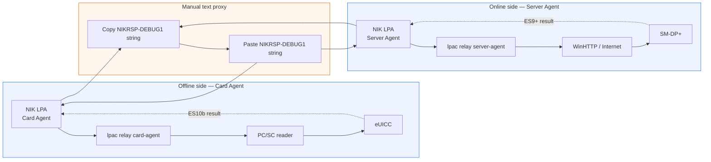
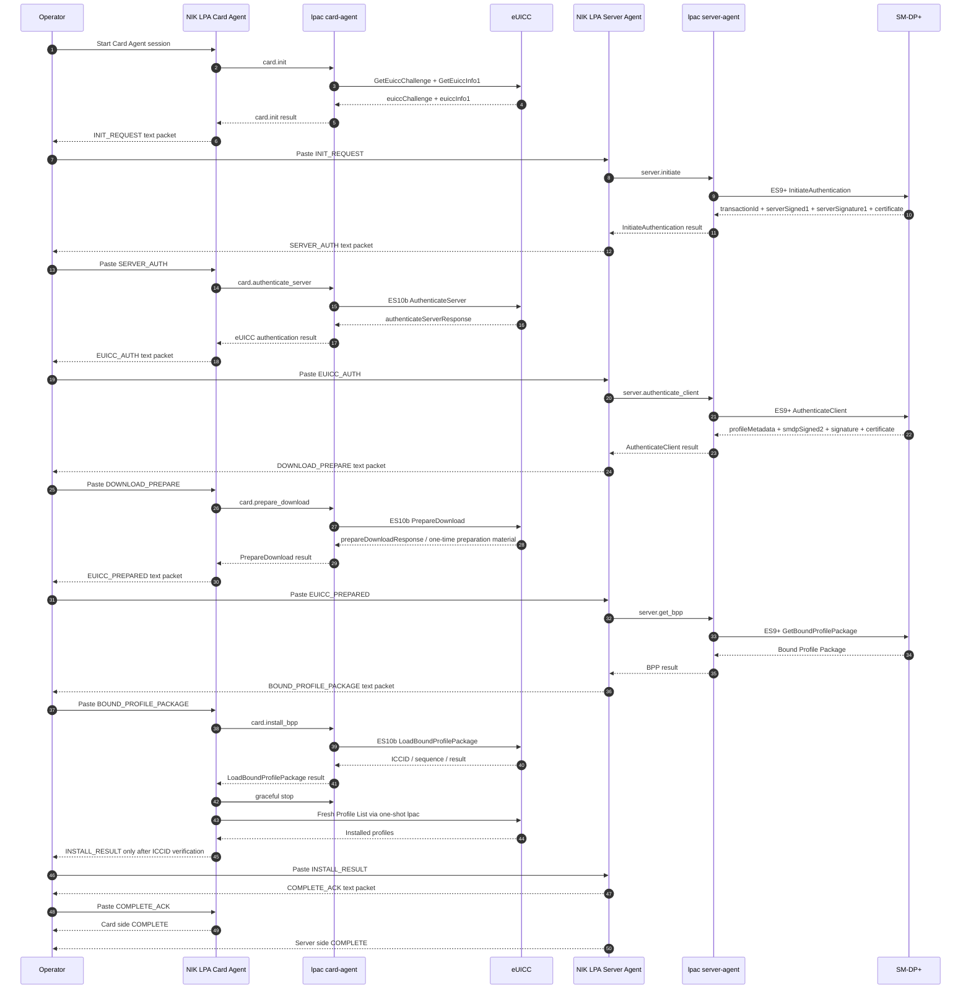

# NIK LPA staged RSP relay

This document explains the current NIK LPA text-proxy workflow from end to end.

The goal is to let the computer attached to the eUICC operate without a normal Internet HTTP backend while a second computer performs the SM-DP+ network side of the same RSP transaction.

## Executive flowchart



### What the diagram means

- The **Card Agent** owns the physical eUICC and PC/SC reader.
- The **Server Agent** owns the Internet connection and SM-DP+ communication.
- The two application instances do not open a direct socket to each other.
- The operator manually transfers the current text packet between them.
- The same SGP.22 transaction is continued across multiple delayed transfers.
- The Card Agent relay process uses `LPAC_APDU=pcsc` and `LPAC_HTTP=stdio`.
- The Server Agent relay process uses `LPAC_APDU=stdio` and `LPAC_HTTP=winhttp`.

## Detailed end-to-end sequence



## Eight relay packets

| # | Packet | Direction | Local action | Remote/server action | Main data transferred |
|---:|---|---|---|---|---|
| 1 | `INIT_REQUEST` | Card → Server | `GetEuiccChallenge`, `GetEuiccInfo1` | prepares `InitiateAuthentication` | `euiccChallenge`, `euiccInfo1` |
| 2 | `SERVER_AUTH` | Server → Card | prepares `AuthenticateServer` | `ES9+ InitiateAuthentication` | `transactionId`, `serverSigned1`, `serverSignature1`, CI key ID, server certificate, server address, Matching ID |
| 3 | `EUICC_AUTH` | Card → Server | `ES10b AuthenticateServer` | prepares `AuthenticateClient` | `authenticateServerResponse` |
| 4 | `DOWNLOAD_PREPARE` | Server → Card | prepares `PrepareDownload` | `ES9+ AuthenticateClient` | `profileMetadata`, `smdpSigned2`, `smdpSignature2`, SM-DP+ certificate, optional confirmation code |
| 5 | `EUICC_PREPARED` | Card → Server | `ES10b PrepareDownload` | prepares `GetBoundProfilePackage` | `prepareDownloadResponse` |
| 6 | `BOUND_PROFILE_PACKAGE` | Server → Card | prepares `LoadBoundProfilePackage` | `ES9+ GetBoundProfilePackage` | `boundProfilePackage` |
| 7 | `INSTALL_RESULT` | Card → Server | `LoadBoundProfilePackage` + fresh `Profile List` | receives verified result | status, verified ICCID, sequence number, notification state |
| 8 | `COMPLETE_ACK` | Server → Card | marks relay complete | marks relay complete | acknowledgement status |

## Packet envelope

During the current engineering/debug phase every transferred line is readable:

```text
NIKRSP-DEBUG1:{"version":1,"job_id":"...","sequence":1,...}
```

The packet contains the following common fields:

```text
version
job_id
sequence
stage
direction
target_eid_hash
transaction_id
created_at
expires_at
previous_message_hash
payload
```

The UI intentionally shows only a short preview by default. The complete JSON can be opened in a dedicated packet window for debugging.

## Validation performed before a packet is accepted

For every incoming packet NIK LPA checks:

1. supported protocol version;
2. correct stage-specific sequence number;
3. correct packet direction;
4. non-empty target EID hash;
5. payload is a JSON object;
6. packet has not exceeded its local deadline;
7. packet belongs to the same job UUID;
8. target eUICC has not changed;
9. timestamps do not move backwards;
10. stage ordering is exact;
11. sequence is continuous;
12. `previous_message_hash` matches the previous packet;
13. `SERVER_AUTH` introduces a transaction ID;
14. all later packets preserve the same transaction ID.

This validation allows the text transfer to be delayed without treating each paste as a new RSP session.

## Why Card Agent can remain without the normal network backend

Card Agent starts the helper with:

```text
LPAC_APDU=pcsc
LPAC_HTTP=stdio
```

Its job is to execute ES10b operations against the physical eUICC. It does not use the WinHTTP relay backend.

Server Agent starts with:

```text
LPAC_APDU=stdio
LPAC_HTTP=winhttp
```

Its job is to execute ES9+ against the SM-DP+. It does not use the PC/SC relay backend.

The operator-created text proxy is the bridge between the two halves.

## Full operator walkthrough

### 1. Prepare Card Agent

1. Start `nik-lpa.exe`.
2. Select **Card Agent**.
3. Select the PC/SC reader.
4. Open **RSP Relay**.
5. Start a new Card Agent session.
6. The app reads EID/chip data and starts the long-lived card relay helper.
7. `card.init` requests the fresh eUICC challenge and EUICCInfo1.
8. The app creates `INIT_REQUEST`.
9. Copy the outgoing `NIKRSP-DEBUG1:` string.

### 2. Prepare Server Agent

1. Start a second `nik-lpa.exe` instance, normally on the Internet-connected computer.
2. Select **Server Agent**.
3. Enter the activation code.
4. Enter the confirmation code only when the profile requires it.
5. Start Server Agent.
6. Paste the `INIT_REQUEST` received from Card Agent.
7. Press the receive/execute action.

### 3. Continue the text proxy

For every stage:

1. copy the outgoing string from the side that produced it;
2. move the string to the other computer by the chosen operator channel;
3. paste it into the incoming field;
4. optionally open the full JSON and inspect the payload;
5. execute the incoming packet;
6. wait until that side generates the next outgoing packet.

The sticky RSP progress block remains visible while the lower content scrolls.

### 4. Profile installation

When Card Agent receives `BOUND_PROFILE_PACKAGE`:

1. it invokes `LoadBoundProfilePackage` on the eUICC;
2. it records the ICCID returned by the operation;
3. it gracefully stops the long-lived PC/SC relay helper;
4. it starts an independent fresh Profile List operation;
5. it confirms the returned ICCID is actually installed;
6. only then does it create `INSTALL_RESULT`.

### 5. Symmetric completion

`INSTALL_RESULT` is transferred to Server Agent.

Server Agent validates it and creates `COMPLETE_ACK`.

The operator transfers `COMPLETE_ACK` back to Card Agent. Only then are both application instances in the completed state.

## Local LPA mode

Local LPA is separate from the text-proxy flow.

When one computer has both the eUICC reader and Internet access, NIK LPA runs the normal one-machine `lpac profile download` path and verifies the profile locally. The staged eight-packet proxy is not involved.

## Debug and security boundary

The current packet transport is intentionally plaintext for protocol debugging. Therefore the transferred JSON may contain sensitive provisioning material.

Do not use `NIKRSP-DEBUG1` as a production secure transport. The final production transport should restore authenticated encryption or use another protected device-to-device channel after the staged protocol flow is considered stable.
